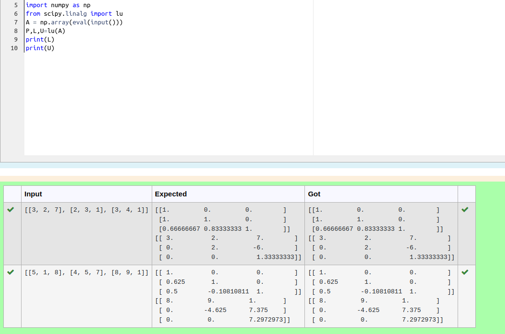
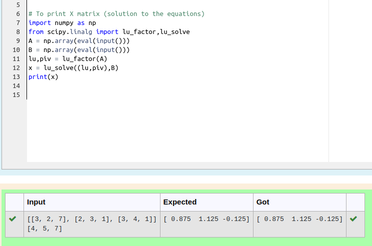

# LU Decomposition 

## AIM:
To write a program to find the LU Decomposition of a matrix.

## Equipments Required:
1. Hardware – PCs
2. Anaconda – Python 3.7 Installation / Moodle-Code Runner

## Algorithm
1. Import numpy library using import statement

2. From scipy package import lu_factor() and lu_solve().

3. Get two inputs from user and pass it as matrix array.

4. Find lu and pivot value of first marix using lu_factor().

5. Find solution of the matrix by using lu_solve() by passing lu, pivot values as first argument and second matrix as second argument.

6. Print the solution.


## Program:
(i) To find the L and U matrix
```
/*
Program to find the L and U matrix.
Developed by: Rakesh J.S
RegisterNumber: 22009339
import numpy as np
from scipy.linalg import lu
A=eval(input())
P,L,U=lu(A)
print(L)
print(U)
*/
```
(ii) To find the LU Decomposition of a matrix
```
/*
Program to find the LU Decomposition of a matrix.
Developed by: Rakesh J.S
RegisterNumber: 22009339
import numpy as np
from scipy.linalg import lu_factor,lu_solve
A=eval(input())
B=eval(input())
lu,piv=lu_factor(A)
X=lu_solve((lu,piv),B)
print(X)
*/
```

## Output:




## Result:
Thus the program to find the LU Decomposition of a matrix is written and verified using python programming.

